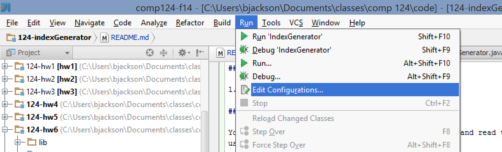
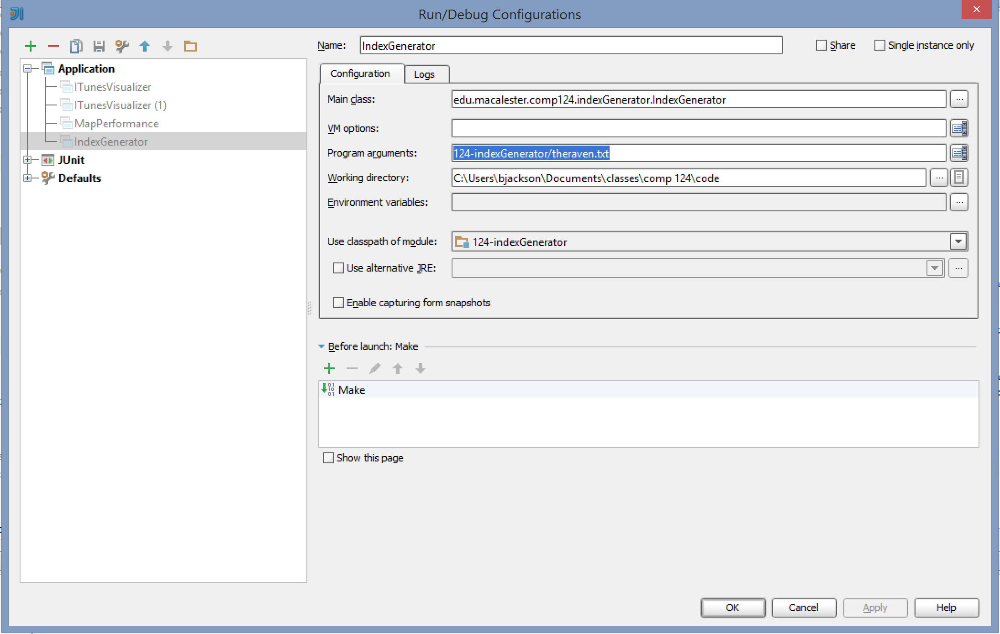

#Comp 124 - Spell Checker Lab
==================

In this lab you will explore how to create a spell checker for a text document such as a book. Your spell checker will load
a file of words to use as a dictionary and store them in a data structure. It will then load the words from a book and check
whether each word is found in the dictionary. Words that are not found are assumed to be misspelled.

##Getting Started

1. Fork and clone this project

##Task 0: Analyze the Existing Code

Your first task is to open the existing classes and read through the code. We have included an interface called WordDictionary
and one implementation of it using a hash map data structure.

To parse the text document we are using the [Java Scanner Class](https://docs.oracle.com/javase/7/docs/api/java/util/Scanner.html).
**Look over the methods for this class in the javadoc.** A scanner allows you to parse a text file line-by-line and separate it
into individual tokens by delimiting the text based on a pattern called a [regular expression](http://ocpsoft.org/opensource/guide-to-regular-expressions-in-java-part-1/).
In our program, each token corresponds with an individual word in the text.

Now, look at the main method. Is there anything new and unfamiliar to you?

##Task 1: Program Arguments

Go ahead and run the existing RunSpellChecker class. What happens?

Up until now the programs you have written have used constant variables to hard-code the file path for where to find your input data.
As you start to write more advanced Java programs, frequently you will want the ability to configure them dynamically each time
you run the program. In this lab, we would like the ability to tell java which text document we want to spell check without specifying it directly in the code.

To accomplish this, we pass parameters, usually called program or command-line arguments, to the java program before it runs. When
Java starts your program, it calls the `main` method and the program arguments are stored as strings in the `args` array that you can
access within the method.

Let's start by getting a text document to use to spell check. Go to the [Project Gutenburg website](https://www.gutenberg.org/)
and download a book. Make sure to download the plain text version and save it as a text document somewhere on your computer.

Now we need to tell intellij that you want to run your program on this specific book. We do that using program arguments:

1. Click the `Run` menu at the top of the screen and select `Edit Configurations...`
2. In the Run/Debug Configuration window that appears, edit the line next to `Program arguments`. This line should be the path
to the text file you created previously. You don't need to do it for this assignment, but if you wanted to pass multiple
program parameters you can add them all to this line separated by spaces. Each argument will be stored in a separate index
in the args array in the `main` method.

##Task 2: Implementing a List and Binary Search Tree Dictionary

We would like to test the performance of several types of data structures we have discussed in class. Start by creating a new
Java class called `ListDictionary`. Your class should implement the `WordDictionary` interface and use an ArrayList to store
the dictionary words.

Create a second class called `BSTDictionary`. This class should also implement the `WordDictionary` interface and use a TreeMap to
store the words.

Uncomment the section in `RunSpellChecker`, and fill in the first two TODO comments in the `SpellChecker` constructor. Run the spell checker.
It should now correctly report the time it takes to print the list of dictionary words alphabetically.

##Task 3: Spell Checking

Complete the TODO comments in the `checkSpelling` method. You can see an example of how to calculate the timing information at the
 end of the SpellChecker constructor.

Print the misspelled words in alphabetical order to make sure it is working correctly. Once it is working, you may want to comment this code out
 so that you can more easily see the timing information that is printed to the console.

##Task 3: Analysis

Run the code and analyze the timing information that results. Does the time to generate a sorted list of dictionary words match your 
expectations? What about the search time? As the size of the dictionary increases or the size of the text increases, how do these change?

##Challenge

If you have finished early and want a challenge, you can make your spell checker more relevant. Currently the checker reports 
words that are plural or in the past tense as misspelled because they don't show up in the dictionary. Can you fix this? A common approach 
uses an algorithm called the [Porter Stemmer](http://www.cs.odu.edu/~jbollen/IR04/readings/readings5.pdf). See if you can implement this to only check whether the word stems are in the dictionary.
 